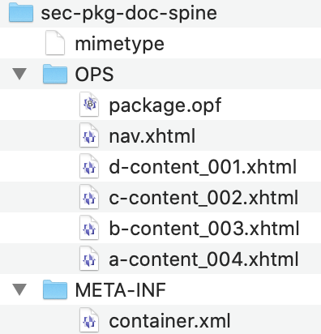

# EPUB 3.3 Explainer

**Written**: 2021-02-22, **Updated**: 2021-10-26 

## Authors:

 * Dave Cramer (Invited Expert)
 
## Participate

 * [Issue Tracker](https://github.com/w3c/epub-specs/issues)
 * [Mailing List](https://lists.w3.org/Archives/Public/public-epub-wg/)
 
## Table of Contents

1. [Introduction](#introduction)
2. [Goals](#goals)
3. [Non-Goals](#non-goals)
4. [Fundamentals](#fundamentals)
5. [Considered Alternatives](#considered-alternatives)
6. [Stakeholder Feedback](#stakeholder-feedback)
7. [Acknowledgements](#acknowledgements)
 
## Introduction

**EPUB 3.3** is a packaging mechanism for web content, designed for electronic books. EPUB's roots go back to 1999, with the OEB 1.0 specification from the Open Ebook Forum (which evolved into the IDPF) In 2007, a packaging format was introduced and OEB became EPUB 2.0. In 2011, EPUB 3.0 added support for XHTML5. Changes since then have been minor. The IDPF was absorbed into W3C in 2017, and responsibility for the maintenance of EPUB fell to the EPUB 3 Community Group, which released EPUB 3.2 in 2019 as a community group note. EPUB is twenty-one years old, but has never gone through the W3C Recommendation track, until now. 

EPUB 3.3 includes the following specifications:

* [EPUB 3.3 Overview](https://w3c.github.io/epub-specs/epub33/overview/), a non-normative overview of EPUB 3.3
* [EPUB 3.3 Core](https://w3c.github.io/epub-specs/epub33/core/), the specification of the file format
* [EPUB 3.3 Reading Systems](https://w3c.github.io/epub-specs/epub33/rs/), the specification for user agents, known as EPUB Reading Systems. 
* [EPUB Accessibility 1.1](https://w3c.github.io/epub-specs/epub33/a11y/)
* [EPUB Accessibility Techniques 1.1](https://w3c.github.io/epub-specs/epub33/a11y-tech/)

EPUB does not fit neatly into the web ecosystem. The content of an EPUB is web stuff: HTML, CSS, images, videos, etc. But EPUBs are not rendered directly in browsers. 

EPUB user agents are called EPUB reading systems. These are most likely apps, using webviews, although they can be constructed as web apps. EPUB reading systems are responsible for providing the entire user interface, enabling navigation, page turns, etc. They may rewrite HTML and CSS to provide UI affordances or to implement pagination. They may inject scripts. The author of the EPUB does not totally control what the end user sees. 

The relationship between the content creator and the end user is likely to be more mediated than is typical on the web. Publishers who create EPUBs seldom provide books directly to the public, but instead work through distributors, retailers, and libraries.


## Goals

* to create a universal standard for the creation, distribution, and consumption of digital books

* to serve as an interchange format between publishers, distributors, and retailers. 

* to create a self-contained package of content that does not depend on a network connection

* to define a linear sequence of HTML files with a preferred order

* to provide for publication-level metadata

* to allow for the syncronization of textual and audio content

* to provide a standard format for digital books for **all*** readers, including those who use assistive technologies.

* to work closely with the creators of the [EPUB Validation Tool](https://github.com/w3c/epubcheck), to encourage conformance to the specifications. 

## Non-goals

* Reaching feature parity with the web platform. Support for HTML forms is not required. Scripting is quite limited. 

* Detailed error handling. EPUB largely tries to avoid detailed descriptions of how to present malformed content to users. 

* Defining the user interface or user experience in detail. We don't ask that every book look exactly the same in every reading system. This also means that content creators generally control the appearance of their books, but have no influence over the UI. This is very different from the web. 

* Creating DRM for ebooks. The EPUB 3 Working Group acknowledges that DRM is widely used, and that it is in fact necessary to support use cases of societal importance such as library lending of ebooks. EPUB can be used with DRM, but DRM is itself out of scope for the working group.

## Fundamentals


### Packaging

An EPUB is a zip archive, containing a `mimetype` file and a mandatory `META-INF` folder. This folder contains a `container.xml` file which points to the package file, which serves as both manifest and metadata for the EPUB. The packaging is adapted from the Open Document Format for Office Applications specification.


 

The package file is the heart of any EPUB, and includes publication metadata, a manifest listing every resource used in the publication, and a spine which determines the linear sequence of content files. 

### Package File (OPF)

```xml
<?xml version="1.0" encoding="UTF-8"?>
<package xmlns="http://www.idpf.org/2007/opf" xmlns:epub="http://www.idpf.org/2007/ops" version="3.0" xml:lang="en" unique-identifier="pub-id">
<metadata xmlns:dc="http://purl.org/dc/elements/1.1/">
  <dc:title>Moby-Dick</dc:title>
  <dc:date>1851-10-21</dc:date>
  <dc:creator>Herman Melville</dc:creator>
  <dc:identifier id="pub-id">urn:isbn:978000000000</dc:identifier>
  <meta property="dcterms:modified">2021-10-14T00:00:00Z</meta>
  <dc:language>en</dc:language>
  <dc:description>
    Ishmael takes an entry-level job processing seafood, but his supervisor’s disregard for safety leads to the liquidation of the business. 
  </dc:description> 
</metadata>
<manifest>
  <item id="c001" href="c001.xhtml" media-type="application/xhtml+xml" />
  <item id="c002" href="c002.xhtml" media-type="application/xhtml+xml" />
  <item id="c003" href="c003.xhtml" media-type="application/xhtml+xml" />
  <item id="c004" href="c004.xhtml" media-type="application/xhtml+xml" />
  <item id="nav" properties="nav" href="toc.xhtml" media-type="application/xhtml+xml" />
</manifest>
<spine>
  <itemref idref="c001" />
  <itemref idref="c002" />
  <itemref idref="c003" />
  <itemref idref="c004" />
</spine>
</package>
```

### Content

EPUB uses the XML serialization of HTML5. There have been many attempts to allow the HTML serialization, but they failed because much of the existing supply chain depends on XML-based tools to process EPUBs, and there has not been implementor interest. 

Scripting is poorly supported in existing EPUB Reading Systems. Since EPUBs are not generally presented to end users via the web, and since most EPUBs are sold by retailers rather than publishers, the idea of an origin is less useful as the basis for a security model. 


## Considered Alternatives

EPUB or its predecessor formats have been in the marketplace for more than two decades. Many alternatives have fallen by the wayside, in spite of various theoretical advantages. The demand for EPUB has proven itself to be strong and long-lasting. 

Many publishers do not have a high level of technical expertise in-house, and rely on outside vendors and tools like InDesign to produce ebooks. Files rarely get updated, and some publishers still produce EPUB 2 even though EPUB 3 was introduced in 2007. The experience of creating ebooks is quite different from the web development experience. There are no dev tools, no developer advocates, very few authoring tools. Change happens slowly or not at all. 

* **PDF** PDF files are self-contained and can support extremely complex designs. But the user experience is poor, as the format does not naturally adapt to varying screen sizes, user font preferences, etc.

* **The Web** Until very recently, web pages didn't work very well without a network connection. It's hard to define a linear reading order across a web site. It's hard to define metadata at a site level rather than a page level. The web is largely funded by advertising, and people who read ebooks have largely preferred paying directly for content. 

* **Web Publications** W3C’s Publishing Working Group developed a [web publications](https://www.w3.org/TR/wpub/) spec based on a JSON-LD manifest similar to the [web application manifest](https://www.w3.org/TR/appmanifest/). This work has been adapted for [audiobooks](https://www.w3.org/TR/audiobooks/), and used internally by EPUB reading systems. But no publisher that we are aware of has adopted the format for authoring. 

* **Older ebook formats** Numerous other ebook formats have been created, but have mostly fallen out of use. The text-only Palm PDB format was both design-limited and hard to produce. Sony's BBeB XML format was extraordinarily complex. Several companies used proprietary packaging mechanisms for OEB (Microsoft LIT, Mobi) but they did not spread outside those companies. 


## Stakeholder Feedback

Amazon supports and ingests EPUB 3 files, then transforms them into proprietary formats.

Apple supports, ingests, distributes, and sells EPUB 3 files.

Barnes & Noble supports, ingests, distributes, and sells EPUB 3 files.

Google supports, ingests, distributes, and sells EPUB 3 files.

Kobo supports, ingests, distributes, and sells EPUB 3 files.

EPUB 3 is produced by nearly every trade and educational publisher in the world, including Editis, Hachette Livre, HarperCollins, Haufe, Kadowakwa, Kodansha, Macmillan, Pearson, Penguin Random House, Shueisha, and Wiley. 

## Acknowledgements

EPUB owes an eternal debt of gratitude to Garth Conboy.

Many thanks for valuable feedback and advice from:

* Ivan Herman

* Dan Lazin

* Wendy Reid

* Tzviya Siegman


